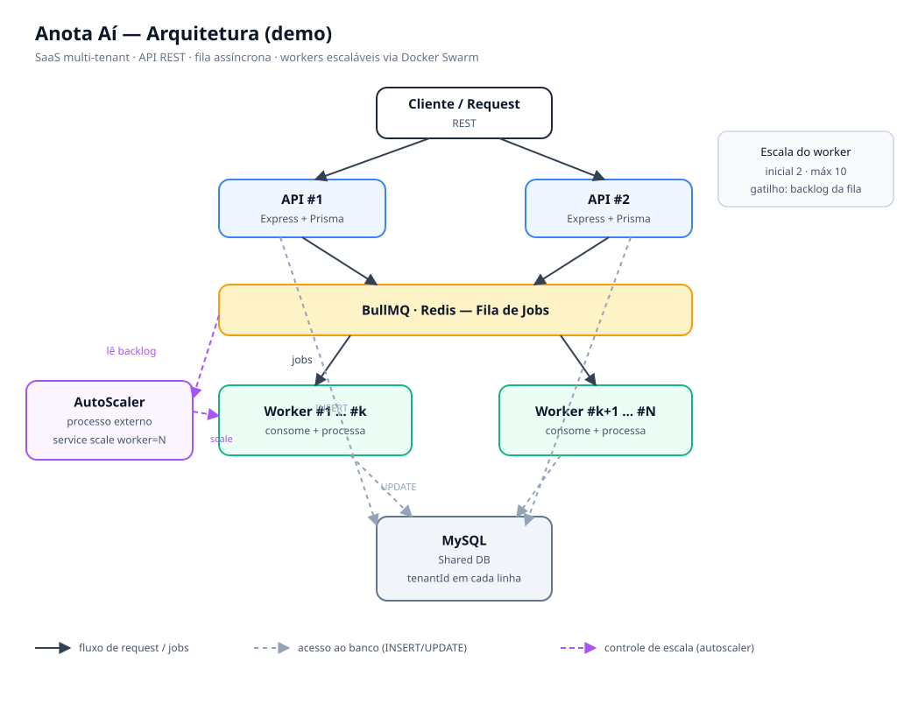

# Anota Aí — Arquitetura Proposta

> Exercício de arquitetura: como eu desenharia e construiria uma aplicação capaz de
> sustentar uma demanda parecida com a do [Anota Aí](https://anota.ai/home/) —
> priorizando **decisões de arquitetura, infraestrutura e escalabilidade**, não só o código.

O objetivo **não** é reproduzir a arquitetura real da empresa, e sim mostrar como eu
estruturaria uma aplicação desse tipo se fosse o responsável pelo projeto: um pedido entra
pela API, é enfileirado e processado de forma assíncrona por *workers* que escalam
horizontalmente conforme a fila cresce.



---

## Stack

| Camada | Tecnologia |
|--------|------------|
| Runtime / linguagem | Node.js + TypeScript |
| API | Express |
| Fila de jobs | BullMQ (sobre Redis) |
| Banco | MySQL |
| ORM / migrations | Prisma |
| Orquestração (demo) | Docker Swarm |
| UI do banco | phpMyAdmin |

---

## Decisões de arquitetura

### SaaS multi-tenant — Shared Database
Todos os estabelecimentos compartilham a mesma base. Cada linha carrega a coluna
`tenantId` (ver [`prisma/schema.prisma`](prisma/schema.prisma), modelo `Order`), com índices
`@@index([tenantId])` e `@@index([tenantId, status])` para manter as consultas performáticas
conforme a base cresce.

Para o escopo deste exemplo existe **uma** tabela (`Order`) como amostra do padrão — num
produto real o mesmo `tenantId` se repetiria nas demais tabelas do domínio.

Na minha visão o *shared database* dá o melhor equilíbrio entre custo, simplicidade
operacional e escalabilidade para esse tipo de produto.

### API REST
Comunicação cliente↔servidor via REST — madura, amplamente adotada e suficiente para o
cenário.

### Arquitetura em camadas
Separação de responsabilidades em **Controller → Service → Repository**:

- **Controller** — valida a entrada (Zod) e devolve a resposta HTTP.
- **Service** — regra de negócio: cria o pedido, enfileira e processa (com idempotência).
- **Repository** — isola o acesso a dados (Prisma); ninguém acima dele conhece o ORM.

Pra este escopo (um domínio simples), 3 camadas é o ponto de equilíbrio: desacopla fila,
worker e persistência sem o excesso de indireção de um DDD completo. Num domínio rico — com
múltiplos agregados e regras complexas — eu evoluiria para DDD.

### Tratamento de erros
Erros são centralizados num **error-handler** (middleware final do Express):

- **Zod** (validação) → `400` com a lista de problemas.
- **JSON malformado** no body → `400`.
- **AppError** de aplicação (`NotFoundError` 404, `ValidationError` 400) → status próprio.
- Qualquer outro → `500` logado, sem vazar detalhe interno.

No worker, falhas são **retentadas** automaticamente pelo BullMQ (`attempts: 3` com backoff
exponencial); o `Service.process` é **idempotente** (job reprocessado num pedido já finalizado
não quebra).

### Transactional Outbox — não perde pedido
Enfileirar **depois** de commitar o pedido tem um furo: se o processo cair entre o commit e o
`queue.add`, o pedido existe mas nunca é processado. A solução é o **outbox**:

- O pedido e um `OutboxEvent` são gravados na **mesma transação** — ou os dois entram, ou
  nenhum. Não existe "pedido sem evento".
- Um **relay** (processo separado, [`src/relay.ts`](src/relay.ts)) lê os eventos `PENDING` e
  publica na fila, marcando `PUBLISHED`.
- O relay usa `FOR UPDATE SKIP LOCKED` para reservar lotes — várias réplicas podem rodar sem
  publicar o mesmo evento. Eventos presos em `PUBLISHING` (relay morreu no meio) são
  recuperados de volta para `PENDING`.

Garante entrega **at-least-once**; a idempotência no processamento cobre a duplicação. Em
escala maior, o mesmo papel pode ser feito por CDC (ex.: Debezium) lendo o binlog.

### Processamento assíncrono
Tarefas pesadas (pagamento, estoque, cozinha, notificação) **não** bloqueiam a resposta da
API. O pedido é criado com status `PENDING`, enfileirado no BullMQ e processado por um
*worker* — que ao final marca `FINISHED` e grava em `processedBy` o *hostname* do container
que processou. É assim que dá pra **ver a divisão de carga** entre réplicas.

---

## Fluxo de um pedido

```
POST /orders
   → Controller valida (Zod)
   → Service.create(): transação { Order (PENDING) + OutboxEvent (PENDING) }   [MySQL]
   ← 201 { id, status: "PENDING" }           (resposta imediata, não espera processar)

Relay (processo separado)
   → lê OutboxEvent PENDING (FOR UPDATE SKIP LOCKED)
   → publica na fila "orders" (BullMQ/Redis) → marca OutboxEvent PUBLISHED

Worker (1..N réplicas) consome o job
   → processa os passos (pagamento, estoque, cozinha, notificação)
   → Service.process() → Repository.markProcessed(hostname)  (status FINISHED)   [MySQL]
```

### Endpoints

| Método | Rota | Body | Descrição |
|--------|------|------|-----------|
| `GET`  | `/health` | — | healthcheck |
| `POST` | `/orders` | `{ "tenantId": 1, "customer": "Fulano", "total": 42.5 }` | cria pedido e enfileira |

---

## Estrutura

```
src/
├── app.ts                      # Express + rotas
├── server.ts                   # entrypoint da API
├── worker.ts                   # entrypoint do worker (processo separado)
├── relay.ts                    # entrypoint do relay da outbox
├── config/
│   ├── prisma.ts               # PrismaClient
│   └── redis.ts                # conexão BullMQ (host/port via env)
├── controllers/
│   └── order.controller.ts
├── services/
│   └── order.service.ts        # create (transação c/ outbox) + process
├── repositories/
│   ├── order.repository.ts     # acesso a dados (isola o Prisma)
│   └── outbox.repository.ts
├── outbox/
│   └── relay.ts                # lê outbox e publica na fila (SKIP LOCKED)
├── validators/
│   └── order.schema.ts         # validação Zod
├── middlewares/
│   └── error-handler.ts        # tratamento central de erros
├── errors/
│   └── app-error.ts
└── queues/
    ├── order.queue.ts          # produtor (fila "orders")
    └── worker.ts               # consumidor + eventos
scripts/
└── autoscaler.ts               # escala réplicas do worker pelo backlog
```

---

## Como rodar

### Pré-requisitos
Docker Desktop, Node 20+.

> A porta do MySQL é publicada em **3307** no host (evita conflito com um MySQL local no 3306).

### Opção A — dev simples (1 processo)

```bash
yarn install
yarn db:up                       # sobe MySQL + Redis + phpMyAdmin (docker compose)
yarn prisma migrate dev
yarn dev                         # API   (:3000)
yarn relay                       # relay: outbox -> fila (outro terminal)
yarn worker                      # worker: processa a fila (outro terminal)
```

### Opção B — Docker Swarm (múltiplas réplicas de worker)

```bash
yarn swarm:build                 # builda a imagem
yarn swarm:init                  # docker swarm init
yarn swarm:deploy                # sobe o stack (api, worker, relay, mysql, redis, phpmyadmin)
yarn swarm:migrate               # aplica as migrations
yarn swarm:scaler                # liga o autoscaler (deixe rodando num terminal)
```

> **compose e swarm não rodam juntos** — disputam as mesmas portas (3307/6379/8080).
> Alterne com `yarn db:down` ↔ `yarn swarm:down`.

### Acessos
- API: http://localhost:3000
- phpMyAdmin: http://localhost:8080 — usuário `queue` / senha `queue`

### Testar

```bash
curl -X POST http://localhost:3000/orders \
  -H "Content-Type: application/json" \
  -d '{"tenantId":1,"customer":"Fulano","total":42.50}'
```

---

## Escalabilidade — o ponto central

A API e os *workers* escalam **horizontalmente e de forma independente**: picos de tráfego
sobem réplicas de API; acúmulo de trabalho pesado sobe réplicas de worker. O banco fica
isolado da camada de aplicação e as tarefas caras ficam desacopladas pela fila.

O [`scripts/autoscaler.ts`](scripts/autoscaler.ts) demonstra isso: um processo externo que lê
o **backlog da fila** no Redis e ajusta as réplicas do worker via `docker service scale`
(Swarm não tem autoscale nativo). Sobe sob carga, desce quando drena.

**Teste de carga** — 10.000 pedidos com 100 requisições paralelas:

```bash
seq 1 10000 | xargs -P 100 -I {} curl -s -X POST http://localhost:3000/orders \
  -H "Content-Type: application/json" \
  -d "{\"tenantId\":1,\"customer\":\"c-{}\",\"total\":42}" -o /dev/null
```

Resultado observado:

| Métrica | Valor |
|---------|-------|
| Réplicas de worker | escalou **1 → 10** conforme o backlog |
| Concorrência por worker | 5 (`WORKER_CONCURRENCY`) → ~50 jobs simultâneos |
| Distribuição | jobs divididos entre todos os containers (visível em `processedBy`) |
| Ao drenar | autoscaler reduz as réplicas de volta |

Parâmetros ajustáveis por env: `SCALE_STEP`, `SCALE_MIN`, `SCALE_MAX`, `SCALE_POLL_MS`,
`WORKER_CONCURRENCY`, `PROC_STEP_MS`, `VERBOSE`.

---

## Infraestrutura que eu adotaria (produção)

O Docker Swarm aqui é **demonstração** de replicação. Num ambiente real eu partiria de:

- **Application Load Balancer (ALB)** distribuindo entre múltiplas instâncias da API.
- **2+ instâncias EC2** (t3.medium/large) executando a aplicação.
- **Amazon RDS (MySQL)** para o banco gerenciado.
- **Amazon ElastiCache (Redis)** para a fila BullMQ.
- Orquestração de containers (ECS/EKS ou Swarm) com autoscaling de API e worker.

No demo, MySQL e Redis rodam como containers no próprio stack — os papéis de RDS/ElastiCache
ficam representados localmente.

---

O foco deste projeto foi mostrar **como eu penso** a construção de aplicações distribuídas —
organização, desacoplamento, escalabilidade e evolução — mais do que apenas entregar uma
implementação funcional.
